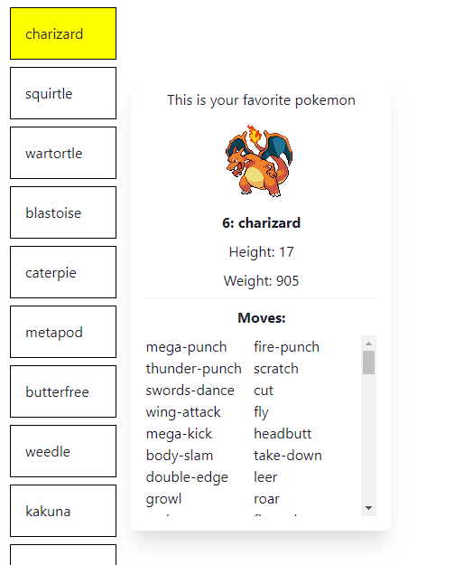
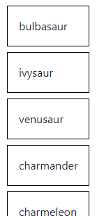
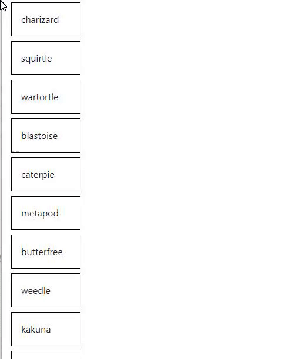
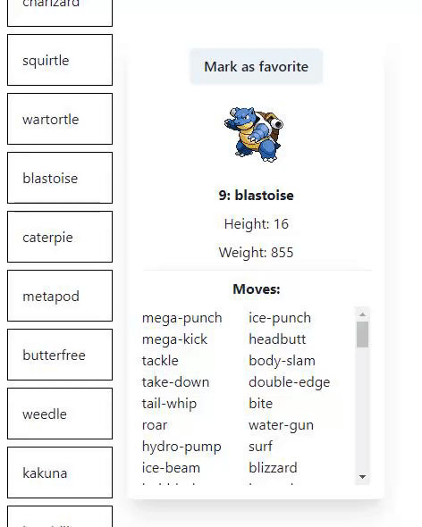

# WeGroup Front-End Assignment

In the next phase of this process we ask you to solve this assignment. This way we can test your knowledge, and verify your skills. We aimed to not make it too long. You’ll approximately need 1h-1h30 to solve it.

As an assignment, you will create a Front-End for a Pokémon API. This will be small and it won’t have much functionality, but it will give us some insight to what you can bring to the team.

If you have any questions or you’re stuck somewhere, you can gather your feedback and forward them to us. We can look for a solution in that case.

Good luck!

## Talking tech

Before starting, we will go over what technologies can be used for this assignment. Everything you need to finish this task is included in the starter project.

### Required tech

You are required to use these technologies. If you use the starter project, these wil already be included in the `package.json`.

- [React](https://reactjs.org/)
  - React knowledge is a must. If you have worked with other Front-End libraries before, you shouldn't have too many issues trying to learn this one.
- [Typescript](https://www.typescriptlang.org/)
  - Typescript is heavily used in our Front-End, so it's important that you have knowledge of this. You shouldn’t have to use any advanced features of typescript in this assignment. So please, don’t worry if you are not too familiar with it yet.
  - If you are struggling with specific types for React, [this cheatsheet](https://react-typescript-cheatsheet.netlify.app/) might help you out
- [Next.JS](https://nextjs.org/)
  - You don’t need to know much about this framework to solve this assignment. It’s used for the starter project and makes deployment super easy. You don't need any knowledge about the extra functionalities it provides.
  - This is what we use for some of our projects and so you will come in touch with it when working at WeGroup.
- Deployment to [Vercel](https://vercel.com/)
  - Deploying to vercel is 100% free for non-commercial sites and it's what we mainly use for deploying our Front-End projects.
  - If there was a good reason why you didn’t deploy to vercel, let us know why. Just make sure it’s deployed somewhere.

We will only test your basic knowledge of React and Typescript. Knowledge about other frameworks is a nice to have, but certainly not a must.

### Recommended tech

Although not required to solve this assignment at all, if you want to solve it easier, we recommended these frameworks:

- [Zustand](https://github.com/pmndrs/zustand) or [Redux toolkit](https://redux-toolkit.js.org/) (Global state management).
- [Axios](https://axios-http.com/docs/intro) (API fetching)
- [React query](https://react-query.tanstack.com/) (API data caching)
- [Chakra UI](https://chakra-ui.com/) (UI library) - We use this framework heavily

Besides the above you are free to use any extra technology that you’d like (like [lodash](https://lodash.com/)) or use a replacement for the ones mentioned above (like another UI library instead of Chakra UI).

Again, we won't test you on knowledge of frameworks. Anything that makes the solving of this assignment easier for you is allowed!

## The assignment

As mentioned before, you will be working with a public Pokémon API. You will create a small web application with some basic styling that fetches a list of Pokémons. From this list, you can select a Pokémon and view the Pokémon in detail. You can also mark a Pokémon as your favorite. This "marking action" will only happen locally, so there will be no API call to actually put this change into a database. As a final touch, think about some extra functionality you could add to this application, try to impress us!

This assignment will give us insights in how well you can create a Front-End application for a Back-End. There are 7 important points where we will rate your code on:

- Using best practices
- Code structure
- Code readability
- State management
- Type usage (do not use the [any](https://www.typescriptlang.org/docs/handbook/2/everyday-types.html#any) type)
- Basic styling
- Usage of git

Here is how the app can look like once the assignment is finished. You don't have to make it look exactly the same. It also doesn't have to be super fancy, but some basic styling to make it easier on the eye is required.



### Before starting

- Fork this repository
- Take a look around the project. If you haven't worked with Next.JS before, it might be useful to take a quick look at [the docs](https://nextjs.org/docs). Don't go too in depth though as you won't need any special functionalities it provides.
- Check out the [Pokémon API](https://pokeapi.co/). You will be using this to fetch data.
- Install dependencies by using `npm i` and start it with `npm run dev`.

### Working out the assignment

#### Task 1: Pokémon list

- Start by creating a component to show a list of Pokémon.
- You can use this endpoint for fetching the Pokémons: `https://pokeapi.co/api/v2/pokemon`.
- Make sure you add typings to the response of the API call. To show you exactly what we mean, we will give you the types for this API call for free:

```ts
interface PokemonList {
  count: number;
  next: string;
  previous: null;
  results: PokemonListItem[];
}

interface PokemonListItem {
  name: string;
  url: string;
}
```

- If you are using axios, you can use the type like this `axios.get<PokemonListResponse>(...)`.

You should have a list of Pokémon that looks like this.



#### Task 2: Pokémon detail

- Add the ability to click onto a list item so that a Pokémon can be viewed in detail.
- Create a component for showing the Pokémon in detail.
- You can use this endpoint for fetching a specific Pokémon: `https://pokeapi.co/api/v2/pokemon/{id or name}/`. The endpoint for each Pokémon is also included in the response of the Pokémon list from the previous task. You may use that one instead.
- The detail component should contain the following data:
  - Id of the Pokémon (`pokemon.id`)
  - Image of the Pokémon (`pokemon.sprites.front_default`)
  - Name of the Pokémon (`pokemon.name`)
  - Height and weight of the Pokémon (`pokemon.height` and `pokemon.weight`)
  - List of moves of the Pokémon (`pokemon.moves`)
- Don't forget to add your typings. Only add types for the properties that are requested! You don't have to fully type the response that the Pokémon API gives as that is too big (and useless) for this assignment.

You should now have a list with the ability to view each Pokémon in detail. The component should only pop up when a Pokémon is selected. If none is selected, the detail component should not show.



#### Task 3: Marking a Pokémon as favorite

- Add a button to the detail component to mark a Pokémon as favorite.
- When a Pokémon is marked as favorite, the list should show this visually (like a different colored background).
- The detail component should also contain an indication that the Pokémon is your favorite.
- You can only have 1 favorite pokemon at a time.

Once this is done, you should be able to mark a Pokémon as favorite and see this visually.



#### Task 4: Add an extra functionality that you can think of

- Try to impress us and add one extra functionality that wasn't mentioned in the assignment.
- This can be simple, or a bit more advanced, whatever you like! Show us your creativity!

### Final result

Once the following requirements are satisfied, your assignment is finished:

- Ability to fetch and view a list of Pokémons.
- Ability to fetch and view a Pokémon in detail which contains the Pokémon's id, image, name, height, weight and a list of the moves.
- Ability to mark a Pokémon as favorite and show this visually.
- 1 extra functionality that you thought of.
- Some basic styling.
- Everything committed to the git repo.

You are always free to make it look super fancy or add even more extra functionality, but this is not required.

### Deploy on Vercel

To finish your assignment, you will have to deploy this to Vercel. Deploying to vercel is super easy. You can simply connect your git repository to a vercel project and everything will automatically be build and deployed.

From the Next.JS docs:

> The easiest way to deploy your Next.js app is to use the [Vercel Platform](https://vercel.com/new?utm_medium=default-template&filter=next.js&utm_source=create-next-app&utm_campaign=create-next-app-readme) from the creators of Next.js.
> Check out our [Next.js deployment documentation](https://nextjs.org/docs/deployment) for more details.

## I'm finished, what now?

You have to send us three items:

- A link to the git repo (make sure it's public).
- A link to the deployment.

That's all!
